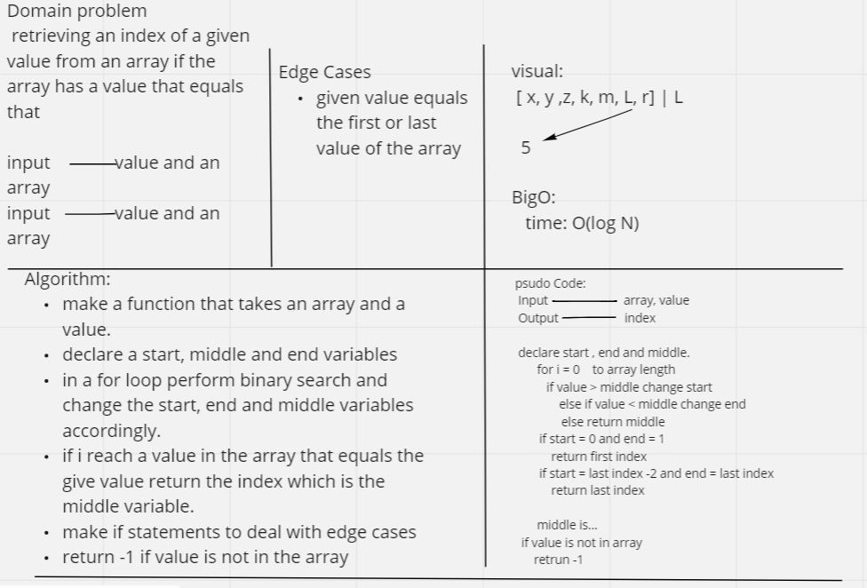
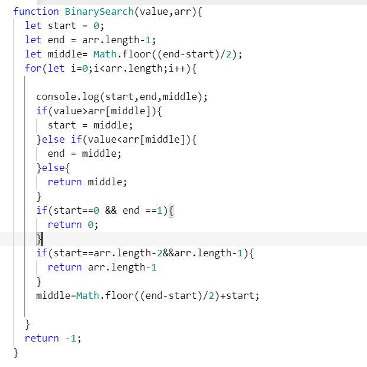

# binary search
perform a binary search to retrieve and index of an equal value in an array

## Whiteboard Process  
  

## Approach & Efficiency
<!-- What approach did you take? Discuss Why. What is the Big O space/time for this approach? -->
used binary search because its faster and doesnt have to go through all of the array to find the index of the value.  
bigO:  
time: O(logN).  
