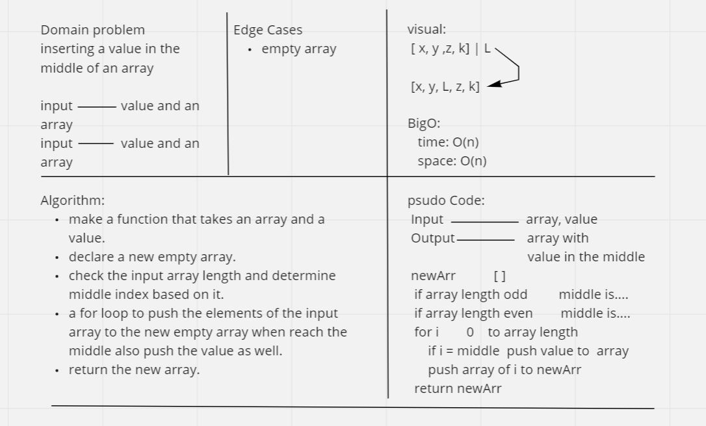
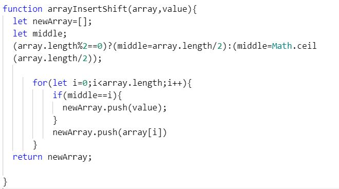

# Insert to Middle of an Array
nsert and shift an array in middle at index

## Whiteboard Process  
  

## Approach & Efficiency
<!-- What approach did you take? Discuss Why. What is the Big O space/time for this approach? -->
use a for loop. because of the conditin of not using built in array.  
bigO:  
time: O(n).  
space: O(n).  