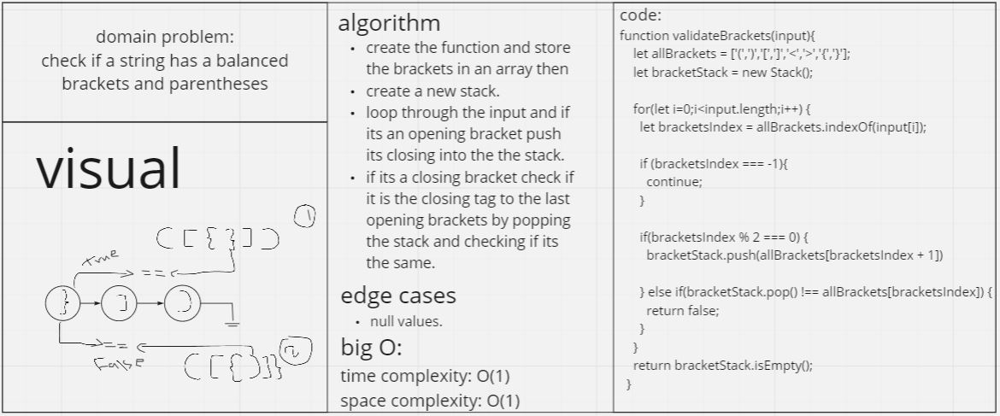

# Stacks and Queues
<!-- Short summary or background information -->
a stack/queue: Is a Nodes-based data structure. Each node in the stack refers to the next node, but does not refer to the preceding node.  
## Challenge
<!-- Description of the challenge -->
validate brackets using a stack or a queue.
## Approach & Efficiency
<!-- What approach did you take? Why? What is the Big O space/time for this approach? -->
enqueue and dequeue methods.
bigO(n) for the methods implemented so far.
## API
<!-- Description of each method publicly available to your Stack and Queue-->
- push(): adds to the begining of the stack or the queue.
- pop(): removes the last element add to the stack or the first element added to the queue.
- isEmpty(): checks whether the stack or the queue is empty.
- peek(): returns the value of the top element in the stack or queue if it exists.

## whiteboard:  

