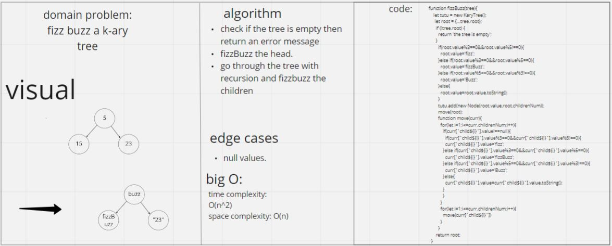

# Trees 
**trees**: A tree is a nonlinear data structure, compared to arrays, linked lists, stacks and queues which are linear data structures. A tree can be empty with no nodes or a tree is a structure consisting of one node called the root and zero or one or more subtrees.  
## Whiteboard Process  
  
## Approach & Efficiency  
i have no idea i worked for 7 hours and it worked in the end.....bigO is most likely trash but im too tired to change it.
